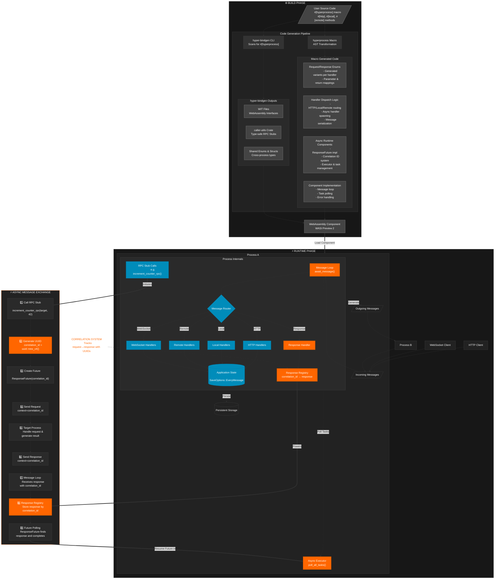

# Hyperware Process Framework


How it feels to use hyperware

## Table of Contents

- [Part 1: User Guide](#part-1-user-guide)
  - [Overview](#overview)
  - [Getting Started](#getting-started)
  - [State Management](#state-management)
  - [Hyperprocess Macro Parameters](#hyperprocess-macro-parameters)
  - [Handler Types](#handler-types)
  - [Special Methods](#special-methods)
    - [Init Method](#init-method)
    - [WebSocket Handler](#websocket-handler)
  - [Binding Endpoints](#binding-endpoints)
    - [HTTP Binding Configuration](#http-binding-configuration)
    - [WebSocket Binding Configuration](#websocket-binding-configuration)
  - [Persistence Options](#persistence-options)
  - [Example Application](#example-application)
- [Part 2: Technical Implementation](#part-2-technical-implementation)
  - [Architecture Overview](#architecture-overview)
  - [Macro Implementation](#macro-implementation)
    - [1. Parsing Phase](#1-parsing-phase)
    - [2. Metadata Collection](#2-metadata-collection)
    - [3. Code Generation](#3-code-generation)
  - [Request/Response Flow](#requestresponse-flow)
  - [Async Runtime](#async-runtime)
    - [ResponseFuture Implementation](#responsefuture-implementation)
    - [Correlation System](#correlation-system)
  - [Executor and Task Management](#executor-and-task-management)
  - [Handler Generation](#handler-generation)
    - [Request and Response Enum Generation](#request-and-response-enum-generation)
    - [Handler Dispatch Generation](#handler-dispatch-generation)
  - [Error Handling Strategy](#error-handling-strategy)
  - [WebAssembly Integration](#webassembly-integration)
    - [WIT Bindings Generation](#wit-bindings-generation)
    - [Component Implementation](#component-implementation)

## Part 1: User Guide

### Overview

This is a process framework abstracting away most of the boilerplate for developing hyperware processes. It unlocks async support by implementing a custom async runtime, and in conjunction with [hyper-bindgen](https://github.com/hyperware-ai/hyper-bindgen), it allows the automatic generation of wit files from defined function endpoints, as well as functions stubs in `caller-utils` in order to be able to have a process asynchronously call another endpoint in another process as if it were a function.

RPC style, but for WASI.

So this includes:

- Defining functions as endpoints (http, remote, local, ws and init)
- Async support
- Automated state persistence with different options

### Getting Started

To create a Hyperware process, you need to:

1. Define your process state as a struct
2. Implement the struct with the `hyperprocess` macro
3. Define handlers for different types of requests

Here's a minimal example:

```rust
#[derive(Default, Debug, Serialize, Deserialize)]
struct MyProcessState {
    counter: u64,
}

#[hyperprocess(
    name = "My Process",
    ui = Some(HttpBindingConfig::default()),
    endpoints = vec![
        Binding::Http { 
            path: "/api", 
            config: HttpBindingConfig::new(false, false, false, None) 
        }
    ],
    save_config = SaveOptions::EveryMessage,
    wit_world = "my-process-dot-os-v0"
)]
impl MyProcessState {
    #[init]
    async fn initialize(&mut self) {
        // Initialize your process
    }
    
    #[http]
    async fn handle_http_request(&mut self, value: String) -> String {
        self.counter += 1;
        format!("Request processed. Counter: {}", self.counter)
    }
}
```

### State Management

Your state should implement the `Default` and `State` traits, and be serializable with `serde`.

### Hyperprocess Macro Parameters

The `hyperprocess` macro accepts the following parameters:

| Parameter | Type | Required | Description |
|-----------|------|----------|-------------|
| `name` | String | Yes | Human-readable name of your process |
| `icon` | String | No | Icon to display in UI |
| `widget` | String | No | Widget type to display in UI |
| `ui` | Option\<HttpBindingConfig\> | Yes | UI configuration |
| `endpoints` | Vec\<Binding\> | Yes | HTTP and WebSocket endpoints |
| `save_config` | SaveOptions | Yes | When to persist state |
| `wit_world` | String | Yes | WIT world name for component model |

Example:

```rust
#[hyperprocess(
    name = "Async Requester",
    ui = Some(HttpBindingConfig::default()),
    endpoints = vec![
        Binding::Http {
            path: "/api",
            config: HttpBindingConfig::new(false, false, false, None),
        },
        Binding::Ws {
            path: "/ws",
            config: WsBindingConfig::new(false, false, false),
        }
    ],
    save_config = SaveOptions::EveryMessage,
    wit_world = "async-app-template-dot-os-v0"
)]
```

### Handler Types

Hyperware processes can handle three types of requests, specified by attributes:

| Attribute | Description |
|-----------|-------------|
| `#[local]` | Handles local (same-node) requests |
| `#[remote]` | Handles remote (cross-node) requests |
| `#[http]` | Handles ALL HTTP requests (GET, POST, PUT, DELETE, etc.) |

These attributes can be combined to make a handler respond to multiple request types:

```rust
#[local]
#[http]
async fn increment_counter(&mut self, value: i32) -> i32 {
    self.counter += value;
    self.counter
}

#[http]
fn handle_any_http(&mut self) -> String {
    // This handles ALL HTTP methods (GET, POST, PUT, DELETE, etc.)
    format!("Handled request to path: {}", get_path().unwrap_or_default())
}

#[remote]
fn get_status(&mut self) -> String {
    format!("Status: {}", self.counter)
}
```

The function arguments and the return values _have_ to be serializable with `Serde`.

#### HTTP Method Support

The `#[http]` attribute supports all HTTP methods by default, or you can specify specific methods:

```rust
// Handle ALL HTTP methods
#[http]
fn handle_all_methods(&mut self, request_data: RequestData) -> Response {
    // Access the current path with get_path()
    // Access query parameters with get_query_params()
    Response::ok()
}

// Handle only specific methods
#[http(method = "GET", path = "/api/items")]
fn list_items(&mut self) -> Vec<Item> {
    // Parameter-less handlers MUST specify a path
    // This only handles GET requests to /api/items
    self.items.clone()
}

#[http(method = "POST")]
async fn create_item(&mut self, item: NewItem) -> ItemResponse {
    // Handlers with parameters can omit the path
    // They are matched by deserializing the request body
    self.items.push(item);
    ItemResponse { success: true }
}

#[http(method = "PUT", path = "/api/item")]
fn update_item(&mut self, item: UpdateItem) -> Result<Item, String> {
    // Handlers with parameters can also specify a path for clarity
    // ...
}

#[http(method = "DELETE", path = "/api/item")]
fn delete_item(&mut self) -> Result<(), String> {
    // DELETE often has no body, so must specify path
    let params = get_query_params();
    let id = params.and_then(|p| p.get("id")?.parse().ok())?;
    // ...
}
```

**Supported Methods**: `GET`, `POST`, `PUT`, `DELETE`, `PATCH`, `HEAD`, `OPTIONS`

**Default Behavior**: 
- `#[http]` without parameters accepts ALL HTTP methods
- `#[http(method = "GET")]` accepts only GET requests

**Important Requirements**:
- **Parameter-less handlers**: Can optionally specify a `path` attribute for exact path matching (e.g., `#[http(method = "GET", path = "/api/users")]`)
- **Handlers without path**: Use `get_path()` and `get_http_method()` inside the handler to determine routing logic
- **Handlers with parameters**: Path is optional; they are matched by deserializing the request body

**Routing System**:
- **Parameter-less handlers**: Matched first by path and HTTP method
- **Handlers with parameters**: Matched by deserializing the request body when no parameter-less handler matches
- If a request body cannot be deserialized to match any handler, a 400 Bad Request is returned
- The framework returns `405 Method Not Allowed` if a request uses a method not accepted by the handler

#### Path-Specific Routing

You can bind HTTP handlers to specific paths using the `path` parameter:

```rust
#[hyperprocess(
    endpoints = vec![
        Binding::Http { path: "/api", config: HttpBindingConfig::default() },
        Binding::Http { path: "/admin", config: HttpBindingConfig::default() }
    ],
    // ... other params
)]
impl MyApp {
    // Parameter-less handler (path REQUIRED)
    #[http(method = "GET", path = "/api/users")]
    fn list_users(&mut self) -> Vec<User> {
        // This handler ONLY responds to GET /api/users
        self.users.clone()
    }
    
    // Handler with parameters (path optional but recommended)
    #[http(method = "POST", path = "/api/users")]
    fn create_user(&mut self, user: NewUser) -> User {
        // This handler ONLY responds to POST /api/users
        let user = User::from(user);
        self.users.push(user.clone());
        user
    }
    
    // Parameter-less handler accepting all methods (path optional)
    #[http(path = "/api/status")]
    fn api_status(&mut self) -> Status {
        // This handles ALL methods to /api/status
        Status { healthy: true }
    }
    
    // Parameter-less handler for any path - uses get_path() for routing
    #[http]
    fn dynamic_handler(&mut self) -> Response {
        match get_path().as_deref() {
            Some("/api/health") => Response::ok("Healthy"),
            Some("/api/version") => Response::ok("1.0.0"),
            _ => Response::not_found("Unknown endpoint")
        }
    }
    
    // Handler with parameters without specific path
    #[http(method = "POST")]
    fn generic_post_handler(&mut self, data: GenericData) -> Response {
        // This handles POST requests with matching body to any path
        Response::ok()
    }
}
```

**Path Binding**: When you specify a path, the handler will ONLY respond to requests for that exact path.

**Routing Priority**:
1. Parameter-less handlers with exact path and method match
2. Parameter-less handlers with exact path (any method)
3. Handlers with parameters matched by request body deserialization
4. Error responses (404 Not Found or 405 Method Not Allowed)

**Compile-Time Validations**:
- All handler names must be unique when converted to CamelCase (e.g., `get_user` and `get_user` conflict)
- Init methods must be async and take only `&mut self`
- WebSocket methods must have exactly 3 parameters: `channel_id: u32`, `message_type: WsMessageType`, `blob: LazyLoadBlob`
- At least one handler must be defined (`#[http]`, `#[local]`, or `#[remote]`)
- The macro provides comprehensive error messages with debugging tips for all validation failures

**Current Limitations**:
- All requests with parameters expect JSON request bodies in the format `{"HandlerName": parameter_value}`
- No automatic query parameter binding (use `get_query_params()` to access them manually)
- WebSocket path routing requires manual checking with `get_path()` in the WebSocket handler

### Special Methods

#### Init Method

To run code on process startup, define:

```rust
#[init]
async fn initialize(&mut self) {
    // Initialization code
}
```

#### WebSocket Handler

For defining a `ws` endpoint, do:

```rust
#[ws]
fn handle_websocket(&mut self, channel_id: u32, message_type: WsMessageType, blob: LazyLoadBlob) {
    // Process WebSocket messages
}
```

if you have multiple ws endpoints, you can match on the ws endpoints with `get_path()`, which will give you an `Option<String>`.
if you want to access the http server, you can call `get_server()`, giving you access to `HttpServer`.

### Binding Endpoints

The `endpoints` parameter configures HTTP and WebSocket endpoints:

```rust
endpoints = vec![
    Binding::Http {
        path: "/api",
        config: HttpBindingConfig::new(false, false, false, None),
    },
    Binding::Ws {
        path: "/ws",
        config: WsBindingConfig::new(false, false, false),
    }
]
```

### Persistence Options

The `save_config` parameter controls when to persist state:

```rust
save_config = SaveOptions::EveryMessage
```

Available options:

| Option | Description |
|--------|-------------|
| `SaveOptions::Never` | Never persist state |
| `SaveOptions::EveryMessage` | Persist after every message |
| `SaveOptions::EveryNMessage(n)` | Persist every n messages |
| `SaveOptions::EveryNSeconds(n)` | Persist every n seconds |

### Example Application

```rust
#[derive(Default, Debug, Serialize, Deserialize)]
struct AsyncRequesterState {
    request_count: u64,
}

#[hyperprocess(
    name = "Async Requester",
    ui = Some(HttpBindingConfig::default()),
    endpoints = vec![
        Binding::Http {
            path: "/api",
            config: HttpBindingConfig::new(false, false, false, None),
        }, 
        Binding::Ws {
            path: "/ws",
            config: WsBindingConfig::new(false, false, false),
        }
    ],
    save_config = SaveOptions::EveryMessage,
    wit_world = "async-app-template-dot-os-v0"
)]
impl AsyncRequesterState {
    #[init]
    async fn initialize(&mut self) {
        // Initialize and make async calls to other processes
        let result = call_to_other_process().await;
    }

    #[http]
    async fn process_request(&mut self, value: i32) -> String {
        self.request_count += 1;
        "Response from process".to_string()
    }

    #[local]
    #[remote]
    fn get_count(&mut self) -> u64 {
        self.request_count
    }

    #[ws]
    fn websocket(&mut self, channel_id: u32, message_type: WsMessageType, blob: LazyLoadBlob) {
        // Process WebSocket messages
    }
}
```

If you want to call a function from another process, you run `hyper-bindgen` (see [hyper-bindgen repo](https://github.com/hyperware-ai/hyper-bindgen)), which will automatically generate `wit` files in `/api`, and a `caller-utils` rust project. If you import it like so, you'll be able to call any endpoint as an async function!

```rust
use caller_utils::async_requester::increment_counter_remote_rpc;
use shared::receiver_address;

async fn my_function() {
    let result = increment_counter_remote_rpc(&receiver_address(), 42, "test".to_string()).await;
    match result {
        SendResult::Success(value) => println!("Got result: {}", value),
        SendResult::Error(err) => println!("Error: {}", err),
    }
}
```

## Query Parameters

For GET requests, query parameters can be accessed using the `get_query_params()` helper function from `hyperware_app_common`:

```rust
use hyperware_app_common::get_query_params;

#[http(method = "GET")]
fn search(&mut self) -> SearchResults {
    if let Some(params) = get_query_params() {
        let query = params.get("q").unwrap_or(&"".to_string());
        // Process search query
    }
    SearchResults::default()
}
```

### Example: Query Parameter Parsing

For a request to `/api/search?q=rust&limit=20&sort=date`:

```rust
#[http(method = "GET")]
fn search(&mut self) -> Vec<SearchResult> {
    if let Some(params) = get_query_params() {
        // params is a HashMap<String, String> with:
        // {"q" => "rust", "limit" => "20", "sort" => "date"}
        
        // Get search query (with default)
        let query = params.get("q")
            .map(|s| s.to_string())
            .unwrap_or_else(|| "".to_string());
        
        // Parse numeric parameters
        let limit = params.get("limit")
            .and_then(|s| s.parse::<usize>().ok())
            .unwrap_or(10);
        
        // Get optional parameters
        let sort_by = params.get("sort")
            .map(|s| s.as_str())
            .unwrap_or("relevance");
        
        // Use the parameters
        self.perform_search(&query, limit, sort_by)
    } else {
        // No query parameters - return empty results
        vec![]
    }
}
```

**Note**: All query parameter values are strings, so you need to parse them to other types as needed.

## Error Handling and Debugging

The framework provides comprehensive error handling and debugging capabilities:

### Comprehensive Logging

The macro generates detailed logging for all operations:

```rust
// Automatically generated logs help track request flow:
// Phase 1: Checking parameter-less handlers for path: '/api/users', method: 'GET'
// Successfully parsed HTTP path: '/api/users' 
// Set current_path to: Some("/api/users")
// Set current_http_method to: Some("GET")
```

### Request Deserialization Errors

When request bodies don't match handler expectations, you get helpful error messages:

```
Failed to deserialize HTTP request into HPMRequest enum.
Error: missing field `CreateUser` at line 1 column 15
Path: /api/users
Method: POST
Body received:
{
  "createuser": "john_doe"
}

Debugging tips:
- Check that your request body matches one of the expected handler parameter types
- For handlers with parameters, the JSON should be in format {"HandlerName": parameter_value}
- For parameter-less handlers, use get_path() and get_http_method() inside handlers to access request context
```

### Compile-Time Validation

The macro catches configuration errors at compile time:

```rust
// This will fail to compile:
#[hyperprocess(
    name = "test-app",
    // Missing required 'endpoints' parameter
    save_config = SaveOptions::Never,
    wit_world = "my-world"
)]
impl MyApp {
    #[init]
    fn init_app(&mut self) -> String {  // ERROR: Init should not return value
        "initialized".to_string()
    }
}
```

### Context Access Helpers

Use these functions to access request context within handlers:

| Function | Returns | Description |
|----------|---------|-------------|
| `get_path()` | `Option<String>` | Current HTTP path |
| `get_http_method()` | `Option<String>` | Current HTTP method |
| `get_query_params()` | `Option<HashMap<String, String>>` | Query parameters |
| `source()` | `Address` | Address of the message sender |

### Two-Phase HTTP Routing

Understanding the routing system helps debug request handling issues:

1. **Phase 1: Parameter-less Handlers** - Matched by path and HTTP method
2. **Phase 2: Body-based Handlers** - Matched by deserializing request body

```rust
// Phase 1: Direct path/method matching
#[http(method = "GET", path = "/health")]
fn health_check(&mut self) -> &'static str { "OK" }

// Phase 2: Body deserialization matching  
#[http(method = "POST")]
fn create_user(&mut self, user: NewUser) -> User { ... }
```

## Common Patterns and Best Practices

### Parameter-less vs Parameter-based Handlers

Choose the right handler type for your use case:

```rust
// ✅ Good: Parameter-less handler for simple endpoints
#[http(method = "GET", path = "/health")]
fn health_check(&mut self) -> &'static str {
    "OK"
}

// ✅ Good: Parameter-less handler with dynamic routing
#[http]
fn api_router(&mut self) -> Response {
    match (get_http_method().as_deref(), get_path().as_deref()) {
        (Some("GET"), Some("/api/users")) => self.list_users(),
        (Some("GET"), Some("/api/stats")) => self.get_stats(), 
        _ => Response::not_found("Endpoint not found")
    }
}

// ✅ Good: Parameter-based handler for complex data
#[http(method = "POST")]
async fn create_user(&mut self, user: CreateUserRequest) -> Result<User, String> {
    // Validates and deserializes complex request automatically
    self.users.push(user.into());
    Ok(user)
}
```

### Error Handling Patterns

```rust
// ✅ Good: Use Result types for handlers that can fail
#[http]
fn risky_operation(&mut self, input: String) -> Result<String, String> {
    if input.is_empty() {
        Err("Input cannot be empty".to_string())
    } else {
        Ok(format!("Processed: {}", input))
    }
}

// ✅ Good: Use custom error types for better error handling
#[derive(Serialize, Deserialize)]
pub enum ApiError {
    ValidationError(String),
    NotFound(String),
    InternalError,
}

#[http]
fn validated_handler(&mut self, data: InputData) -> Result<OutputData, ApiError> {
    data.validate()
        .map_err(|e| ApiError::ValidationError(e))?;
    
    self.process(data)
        .map_err(|_| ApiError::InternalError)
}
```

### State Management Best Practices

```rust
#[derive(Default, Serialize, Deserialize)]
struct MyAppState {
    // ✅ Use reasonable defaults
    pub counter: u64,
    pub users: Vec<User>,
    
    // ✅ Use Options for optional state
    pub last_sync: Option<SystemTime>,
    
    // ✅ Group related data
    pub config: AppConfig,
}

impl MyAppState {
    // ✅ Provide helper methods for common operations
    fn increment_counter(&mut self) -> u64 {
        self.counter += 1;
        self.counter
    }
    
    fn add_user(&mut self, user: User) -> Result<(), String> {
        if self.users.iter().any(|u| u.id == user.id) {
            return Err("User already exists".to_string());
        }
        self.users.push(user);
        Ok(())
    }
}
```

### Async Handler Patterns

```rust
#[http]
async fn fetch_external_data(&mut self, query: String) -> Result<String, String> {
    // ✅ Good: Use the built-in send function for RPC calls
    let result = send::<ExternalApiResponse>(
        ExternalApiRequest { query },
        &external_service_address(),
        10 // timeout in seconds
    ).await;
    
    match result {
        SendResult::Success(response) => Ok(response.data),
        SendResult::Timeout => Err("Request timed out".to_string()),
        SendResult::Offline => Err("External service unavailable".to_string()),
        SendResult::DeserializationError(e) => Err(format!("Invalid response: {}", e)),
    }
}
```

## Part 2: Technical Implementation

### Architecture Overview

Barebones hyperware processes use erlang style message passing. When wanting to send messages asynchronously, you had to send off a request, but handle the response in the response handler residing in another part of the code, adding a context switching cost. Being able to call things asynchronously makes things much more linear and easier to read and process, both for humans and LMs.

This was achieved by implementing our own async runtime. Given that processes are always single threaded, and the only real event occurs is when a message (either a request or response) is read with `await_message()`, we managed to implement a runtime through callbacks and other tricks.

### Macro Implementation

The `hyperprocess` macro transforms a struct implementation into a fully-featured process:

#### 1. Parsing Phase

The macro will parse arguments like so:

```rust
fn parse_args(attr_args: MetaList) -> syn::Result<HyperProcessArgs> {
    // Parse attributes like name, icon, endpoints, etc.
    // Validate required parameters
    
    Ok(HyperProcessArgs {
        name: name.ok_or_else(|| syn::Error::new(span, "Missing 'name'"))?,
        icon,
        widget,
        ui,
        endpoints: endpoints.ok_or_else(|| /* error */)?,
        save_config: save_config.ok_or_else(|| /* error */)?,
        wit_world: wit_world.ok_or_else(|| /* error */)?,
    })
}
```

It also checks the method signatures:

```rust
fn validate_init_method(method: &syn::ImplItemFn) -> syn::Result<()> {
    // Ensure method is async
    if method.sig.asyncness.is_none() {
        return Err(syn::Error::new_spanned(
            &method.sig,
            "Init method must be declared as async",
        ));
    }
    
    // Check parameter and return types
    // ...
}
```

#### 2. Metadata Collection

It then builds metadata:

```rust
fn analyze_methods(impl_block: &ItemImpl) -> syn::Result<(
    Option<syn::Ident>,    // init method
    Option<syn::Ident>,    // ws method
    Vec<FunctionMetadata>, // request/response methods
)> {
    let mut init_method = None;
    let mut ws_method = None;
    let mut function_metadata = Vec::new();

    for item in &impl_block.items {
        if let syn::ImplItem::Fn(method) = item {
            // Check method attributes and process accordingly
            if has_attribute(method, "init") {
                // Process init method
            } else if has_attribute(method, "ws") {
                // Process WebSocket method
            } else if has_http || has_local || has_remote {
                // Process handler methods
                function_metadata.push(extract_function_metadata(
                    method, has_local, has_remote, has_http,
                ));
            }
        }
    }

    Ok((init_method, ws_method, function_metadata))
}
```

#### 3. Code Generation

Under the hood, everything is still regular hyperware message passing, with the body being either a `Request` or `Response` enum. Whenever you define a new function/endpoint, it generates appropriate request and response variants, with the name of the function being the variant in CamelCase.

The inner values of the request variants will be the function arguments as tuples, the inner valus of the response variants will be return value of the defined function.

```rust
fn generate_component_impl(...) -> proc_macro2::TokenStream {
    quote! {
        // Generate WIT bindings
        wit_bindgen::generate!({...});

        // Include user's implementation
        #cleaned_impl_block

        // Add generated request/response enums
        #request_enum
        #response_enum

        // Add message handler functions
        #message_handlers

        // Create and export component
        struct Component;
        impl Guest for Component {...}
        export!(Component);
    }
}
```

### Request/Response Flow

The flow of a request through the system:

1. Message arrives (HTTP, local, or remote)
2. For HTTP requests:
   - First attempts to match parameter-less handlers by path and method
   - If no match, attempts to deserialize body and match handlers with parameters
3. For local/remote requests:
   - Deserializes body into Request enum
4. Appropriate handler is dispatched based on message type
5. For async handlers, the future is spawned on the executor
6. When handler completes, response is serialized and sent back
7. For async handlers, awaiting futures are resumed with the response

#### HTTP Request Routing Details

The HTTP routing system uses a two-phase approach:

**Phase 1: Parameter-less Handler Matching**
- Checks incoming path and HTTP method against parameter-less handlers
- These handlers are matched directly without body deserialization
- Useful for GET endpoints, health checks, and other body-less requests

**Phase 2: Body-Based Handler Matching**
- Only triggered if no parameter-less handler matches
- Deserializes request body to determine which handler to invoke
- Matches handlers that expect parameters

This design allows clean APIs for simple endpoints while maintaining flexibility for complex requests:

```rust
// Phase 1: Matched by path/method
#[http(method = "GET", path = "/health")]
fn health_check(&mut self) -> &'static str { "OK" }

// Phase 2: Matched by body deserialization
#[http(method = "POST")]
fn process_data(&mut self, data: MyData) -> Result<Response, Error> { ... }
```

### Async Runtime

Here is how the async runtime works on a high level.

#### ResponseFuture Implementation

Core type that suspends execution until a response arrives:

```rust
struct ResponseFuture {
    correlation_id: String,
}

impl Future for ResponseFuture {
    type Output = Vec<u8>;

    fn poll(self: Pin<&mut Self>, _cx: &mut Context<'_>) -> Poll<Self::Output> {
        let correlation_id = &self.correlation_id;

        // Check if response has arrived in registry
        let maybe_bytes = RESPONSE_REGISTRY.with(|registry| {
            let mut registry_mut = registry.borrow_mut();
            registry_mut.remove(correlation_id)
        });

        if let Some(bytes) = maybe_bytes {
            // Response found - resume execution
            Poll::Ready(bytes)
        } else {
            // Response not yet received - suspend
            Poll::Pending
        }
    }
}
```

#### Correlation System

The correlation system works by generating a unique correlation ID (UUID) for each request and attaching it to outgoing requests in the context field. Responses are stored in RESPONSE_REGISTRY keyed by their correlation ID. The ResponseFuture polls RESPONSE_REGISTRY until the matching response arrives.

This design enables async handlers to suspend execution while waiting for responses, with multiple requests able to be in flight simultaneously. When responses come back, they can be correctly routed to the handler that is awaiting them based on the correlation ID. The system also supports timeouts by tracking how long responses have been pending.

The implementation uses thread locals to avoid synchronization overhead, since the process runs in a single-threaded environment. This lock-free approach keeps the correlation system lightweight and efficient while maintaining the ability to track request/response pairs reliably.

```rust
pub async fn send<R>(
    message: impl serde::Serialize,
    target: &Address,
    timeout_secs: u64,
) -> SendResult<R>
where
    R: serde::de::DeserializeOwned,
{
    // Generate unique correlation ID
    let correlation_id = Uuid::new_v4().to_string();
    
    // Send request with correlation ID
    let _ = Request::to(target)
        .body(serde_json::to_vec(&message).unwrap())
        .context(correlation_id.as_bytes().to_vec())
        .expects_response(timeout_secs)
        .send();

    // Await response with matching correlation ID
    let response_bytes = ResponseFuture::new(correlation_id).await;
    
    // Process response...
}
```

### Executor and Task Management

The executor manages async tasks within the single-threaded environment:

```rust
pub struct Executor {
    tasks: Vec<Pin<Box<dyn Future<Output = ()>>>>,
}

impl Executor {
    pub fn new() -> Self {
        Self { tasks: Vec::new() }
    }

    pub fn spawn(&mut self, fut: impl Future<Output = ()> + 'static) {
        self.tasks.push(Box::pin(fut));
    }

    pub fn poll_all_tasks(&mut self) {
        let mut ctx = Context::from_waker(noop_waker_ref());
        let mut completed = Vec::new();

        // Poll all tasks
        for i in 0..self.tasks.len() {
            if let Poll::Ready(()) = self.tasks[i].as_mut().poll(&mut ctx) {
                completed.push(i);
            }
        }

        // Remove completed tasks in reverse order
        for idx in completed.into_iter().rev() {
            let _ = self.tasks.remove(idx);
        }
    }
}
```

The executor is polled in the main event loop, right before we await a message. So if a response comes back, we make sure that everything is properly 'linked'.

```rust
loop {
    // Poll tasks between message handling
    APP_CONTEXT.with(|ctx| {
        ctx.borrow_mut().executor.poll_all_tasks();
    });
    
    // Wait for next message (blocking)
    match await_message() {
        // Process message...
    }
}
```

### Handler Generation

The macro generates specialized code for each handler method.

#### Request and Response Enum Generation

The macro extracts parameter and return types from each method:

```rust
fn extract_function_metadata(method: &syn::ImplItemFn, is_local: bool, is_remote: bool, is_http: bool) -> FunctionMetadata {
    // Extract parameter types (skipping &mut self)
    let params = method.sig.inputs.iter().skip(1)
        .filter_map(|input| {
            if let syn::FnArg::Typed(pat_type) = input {
                Some((*pat_type.ty).clone())
            } else {
                None
            }
        })
        .collect();

    // Extract return type
    let return_type = match &method.sig.output {
        ReturnType::Default => None, // () - no explicit return
        ReturnType::Type(_, ty) => Some((**ty).clone()),
    };

    // Create variant name (snake_case to CamelCase)
    let variant_name = to_camel_case(&ident.to_string());

    FunctionMetadata {
        name: method.sig.ident.clone(),
        variant_name,
        params,
        return_type,
        is_async: method.sig.asyncness.is_some(),
        is_local,
        is_remote,
        is_http,
    }
}
```

For example, given these handlers:

```rust
#[http]
async fn get_user(&mut self, id: u64) -> User { ... }

#[local]
#[remote]
fn update_settings(&mut self, settings: Settings, apply_now: bool) -> bool { ... }
```

The macro generates these enums:

```rust
enum Request {
    GetUser(u64),
    UpdateSettings(Settings, bool),
}

enum Response {
    GetUser(User),
    UpdateSettings(bool),
}
```

#### Handler Dispatch Generation

For each handler, the macro generates dispatch code:

**Async Handler Example**:

```rust
Request::FetchData(id) => {
    let id_captured = id;  // Capture parameter before moving
    let state_ptr: *mut MyState = state; 
    
    hyper! {
        let result = unsafe { (*state_ptr).fetch_data(id_captured).await };
        
        // For remote/local handlers
        let resp = Response::new()
            .body(serde_json::to_vec(&result).unwrap());
        resp.send().unwrap();
    }
}
```

The `hyper!` macro lets our custom runtime execute this async code.

#### WIT Bindings Generation

We parse the `wit_world` in our `/api` folder with:

```rust
wit_bindgen::generate!({
    path: "target/wit",
    world: #wit_world,
    generate_unused_types: true,
    additional_derives: [
        serde::Deserialize, 
        serde::Serialize, 
        process_macros::SerdeJsonInto
    ],
});
```

Note: The `wit` files will always get generated with `hyper-bindgen`, which you have to call before `kit b`. More info [in the hyper-bindgen repository](https://github.com/hyperware-ai/hyper-bindgen).
```rust
struct Component;
impl Guest for Component {
    fn init(_our: String) {
        // Initialize state
        let mut state = initialize_state::<#self_ty>();

        // Set up server and UI
        let app_name = #name;
        let app_icon = #icon;
        let app_widget = #widget;
        let ui_config = #ui;
        let endpoints = #endpoints;

        // Setup UI if needed
        if app_icon.is_some() && app_widget.is_some() {
            homepage::add_to_homepage(app_name, app_icon, Some("/"), app_widget);
        }

        // Initialize logging
        logging::init_logging(...);

        // Setup server with endpoints
        let mut server = setup_server(ui_config.as_ref(), &endpoints);
        
        // Call user's init method if provided
        if #init_method_ident.is_some() {
            #init_method_call
        }

        // Main event loop
        loop {
            // Poll pending async tasks
            APP_CONTEXT.with(|ctx| {
                ctx.borrow_mut().executor.poll_all_tasks();
            });

            // Wait for next message and handle it
            match await_message() {
                // Message handling...
            }
        }
    }
}

```


Here is an overly complex llm generated graph that looks cool.




## Todos

- Let the new kit templates make use of the new framework